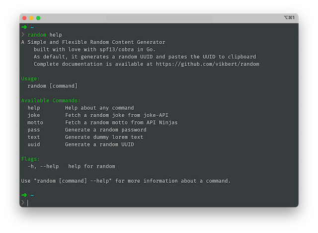
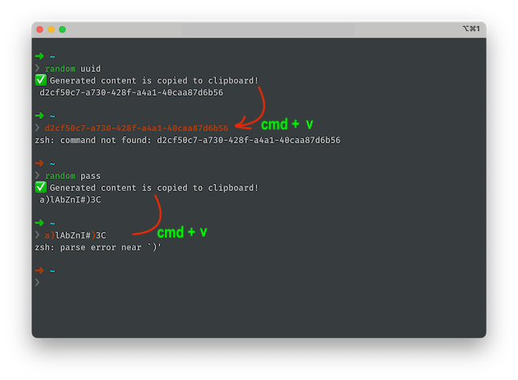

<div align="center">
    
    <p>A Simple and Flexible Random Content Generator built with love with <code>cobra</code> in <code>Golang</code></p>
</div>

<p align="center">
    <a href="#">
        
    </a>
    <a href="#">
        
    </a>
</p>

<div align="center">
    
</div>


## Install

```bash
go install github.com/vikbert/random
```

```bash
random help
```

## Usage

```bash
random -h
random uuid -h
random pass -h
```





| Commands  | Description |
|---|---|
| uuid  | generate & paste an UUID ✅ |
| pass | generate & paste a password ✅ |
| text  |  generate & paste a dummy text ✅ |
| joke  |  display a random joke ✅ |
| motto  |  display a random motto ✅ |

## Development

```bash
git clone https://github.com/vikbert/random.git
cd random
go run main.go
```

## Licence

[MIT](./LICENSE) License © 2023 [@vikbert](https://vikbert.github.io/)


## Thanks

Cobar.dev

https://cobra.dev/

Joke API

https://sv443.net/jokeapi/v2/

Quotes API

https://api-ninjas.com/api/quotes
